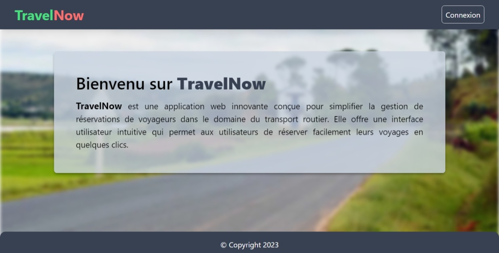

# TravelNow

TravelNow is an online national road travel seat reservation web application in Madagascar built by a junior full-stack web developer to gain practical experience in web development.

## Screenshot

## Features

- **User Authentication:** Users can create an account and log in to the platform.

- **Search Reservations:** Users can search for travel reservations based on the following criteria:

  - Departure location
  - Arrival location
  - Preferred departure date

- **Seat Reservation:** Users can reserve multiple seats for a specific journey.

## Technologies Used

- [Next.js 13](https://nextjs.org/)
- [React with TypeScript](https://www.typescriptlang.org/)
- [Tailwind CSS](https://tailwindcss.com/)
- [MongoDB](https://www.mongodb.com/)
- [Prisma](https://www.prisma.io/)
- [NextAuth](https://next-auth.js.org/)

## Getting Started

To get started with TravelNow, follow these steps:

1. Clone the repository to your local machine.
2. Install the necessary dependencies using `npm install`.
3. Set up the database with MongoDB and Prisma.
4. Configure your environment variables.
5. Run the application using `npm run dev`.

## Usage

1. Create an account or log in to your existing account.
2. Use the search functionality to find travel reservations that match your preferences.
3. Reserve seats for your preferred journeys.

## Contributing

Contributions to TravelNow are welcome. If you would like to contribute, please fork the repository, make your changes, and submit a pull request.

## License

This project is licensed under the [MIT License](LICENSE).

---

Thank you for using TravelNow!
